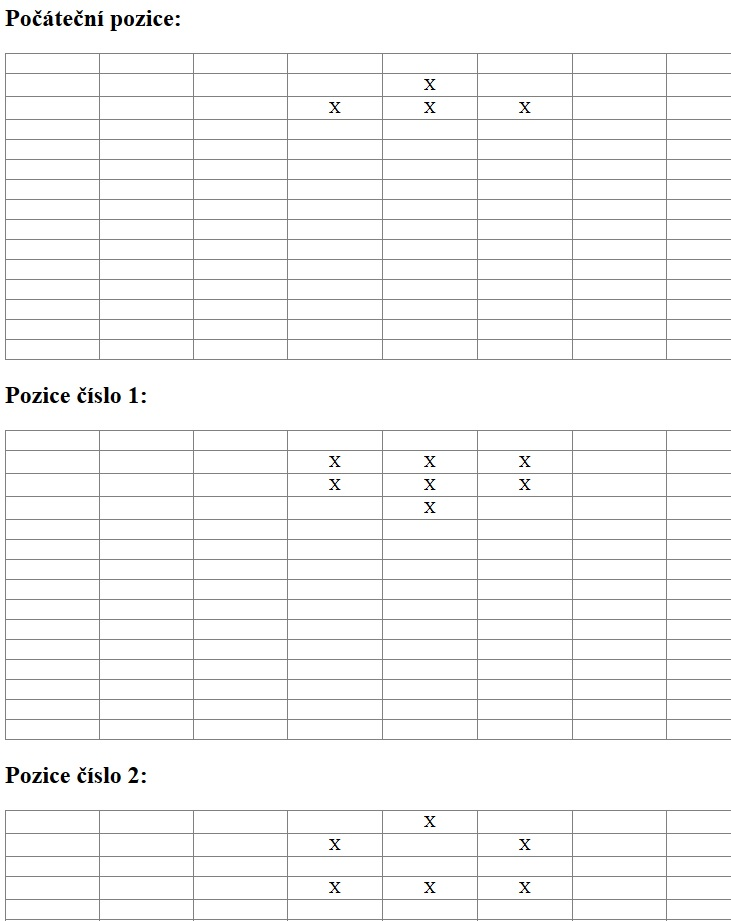

== GrLife - pokusy s Groovy

- vygeneruje html stránku plnou tabulek na kterých lze studovat postupnou zmìnu množení bunìk ve známé høe Life.

=== ToDo

- dokonèit skupinu tøíd *BackSearch+ReversePlaceVariation+ReversePos* pro zpìtné hledání pøedchozí generace
- zkusit zabalit do funkèního šifrování, kde klíèem by bylo èíslo, pøedstavující poèet generací, které je potøeba nechat zrodit, než bude zpráva rozšifrována

